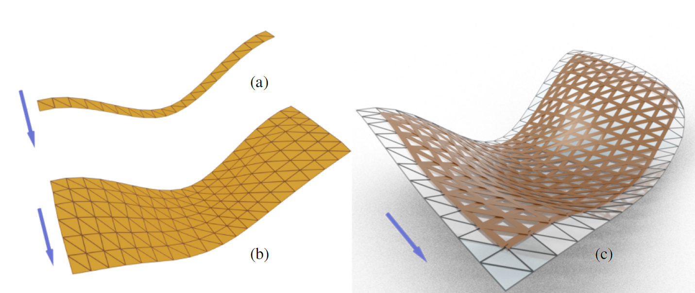
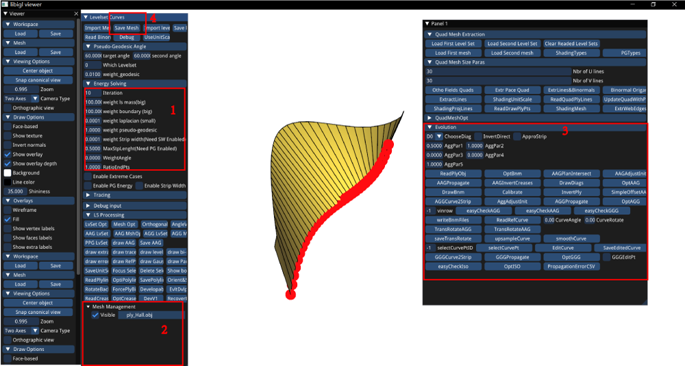

# Webs via Propagation
  

This is an implementation of the paper "Computational design of asymptotic geodesic hybrid gridshells via propagation algorithms, CAD 2024". The code is implemented in C++, and tested on MSVC and GCC. This is developed based on the framework of [Rectifying Strip Patterns](https://github.com/wangbolun300/RectifyingStripPatterns), but we enhanced the abilities for gridshell design. Using our code, you can start from a existing regular web (the distribution of the vertices is in the form of a $m\times n$ grid), a strip (constructed by $2\times n$ vertices), or even a polyline ($n$ vertices), and gradually expand the web into a AAG, AGG, or GGG until reaching the desired size. 

## Citation

If you use our code in your project, please consider citing the [original paper](TODO):

```bibtex
@article{Wang:2024:WebsPropagation,
    title        = {Computational design of asymptotic geodesic hybrid gridshells via propagation
algorithms},
    author       = {Wang, Bolun and Almaskin, Maryam and Pottmann, Helmut},
    year         = 2024,
    month        = xx,
    journal      = {Computer-Aided Design},
    volume       = XX,
    number       = XX,
    articleno    = xx,
    numpages     = XX
}
```

## Compiling Instruction 
To compile the code, first you need to install CMake (https://cmake.org/), 
To build the executable on Linux or macOS:
```sh
cd WebsViaPropagation/
mkdir build
cd build
cmake ../  -DCMAKE_BUILD_TYPE=Release
make
```
To build it on MSVC, you need to download [openmesh](https://gitlab.vci.rwth-aachen.de:9000/OpenMesh/OpenMesh/-/jobs/156362/artifacts/raw/OpenMesh-9.1.0.zip) into the "external" folder, unzip it into "external/openmesh/OpenMesh-9.1.0" and build it into "external/openmesh/OpenMesh-9.1.0/build".

Then double-click the executable `lsc_devbin`, you will see a pop-out window whose buttons link the functions that generate all the results in our paper. 


## Usage
Some useful shortcuts:
* `i` is to invert the normal directions of the viewer.
* `d` is to enable double-sided rendering.
* `x` is to delete the selected mesh in the `Mesh Management` list.

Some tips:
* Please always check if there is any new mesh added into the `Mesh Management` list. Sometimes after pressing the buttons, there is no change in the main view window, but the new mesh is already added into the list. To see the renderings of the new results you need to make other meshes invisible by clicking the checker boxes on the left of the mesh files.
* Please always check the information printed in the terminal, it will tell you the numerical errors, how to read/write files after pressing the corresponding buttons, etc.


### The GUI.
 

Ignoring the buttons inherited from Rectifying Strip Patterns, the buttons or inputs that are useful for our project are marked in the 4 squares in the figure. They are
1. the parameters. The `weight boundary` is $\lambda_{appro}$ in our paper. `weight laplacian` = $\lambda_{fair}$, `weight pseudo-geodesic` is the weights for $E_{ggg}$, $E_{agg}$ or $E_{aag}$, which is a constant number 1.0 in the paper. `WeightAngle` = $\lambda_{guide}$ for the guide curves.
2. the file list. Every time when the optimization is finished, the result file is shown here. 
3. the buttons for loading, propagating, and optimizing webs. 
4. the `Save Mesh` button. Clicking on the target mesh in the `Mesh Management` list, and save the mesh by clicking `Save Mesh`.

Next is the basic pipeline for the usage.
* Load files. Click on `ReadPlyObj`, you will be able to read a initial curve where you can start your propagation. If you want to read a strip (the size is $2\times n$) or a web (the size is $m\times n$), you need to first specify the parameter `vinrow` = $n$, which is the number of vertices added to the existing web in each propagation. Then click on `easyCheckXXX`, where `XXX` is either `AGG`, `AAG` or `GGG`.  
* Propagate. For AAG, first `AAGPlanIntersect` to compute the rectifying strip, then click on `AAGAdjustInit` 3~5 times to update the propagated vertices, each clicking does one round of coordinate-decent optimization, and click on `AAGPropagate` to finish the propagation. For AGG, first `AGGCurve2Strip`, then 3~5 times of `AGGAdjustInit`, finally `AGGPropagate`. For GGG, First `GGGurve2Strip`, then `GGGPropagate`, finally `OptGGG`.
* You can also use `DevV1` to try the first version of rectifying strips mentioned in our paper.


## Some more info
* There are more buttons for visualizing the level sets for AAG and the optimization errors, getting the statistics for timing, optimizing triangle meshes, designing curves with constant slope, etc. For most of the buttons you can understand them easily by their names. If you are not sure what the button does, please read our code!
* It requires some technique and experience to get high-quality, visually pleasing results. In the data folder, there are some data for you to test.
