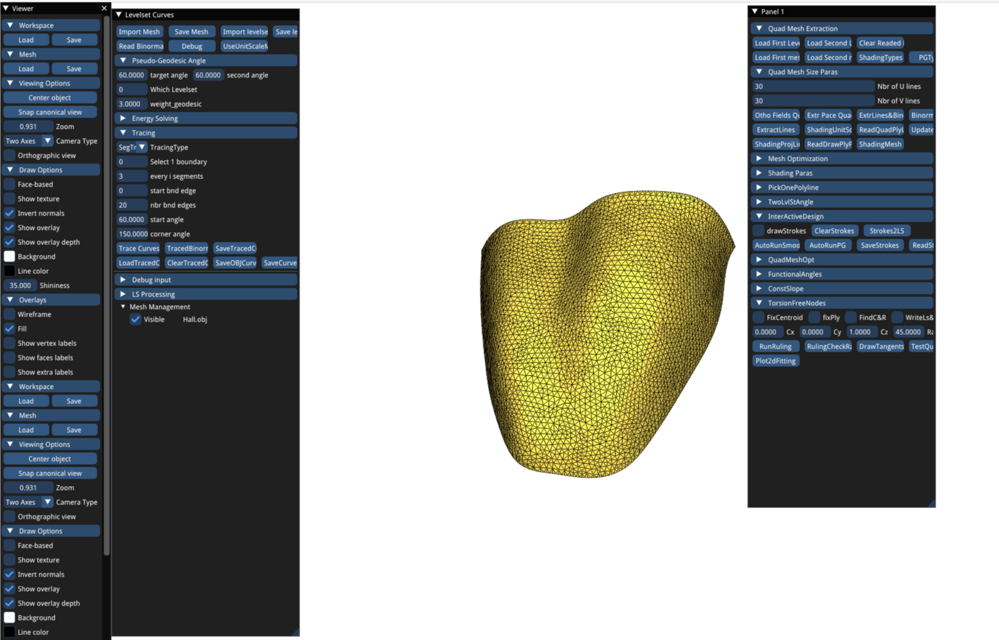
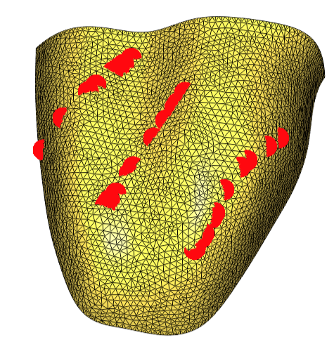
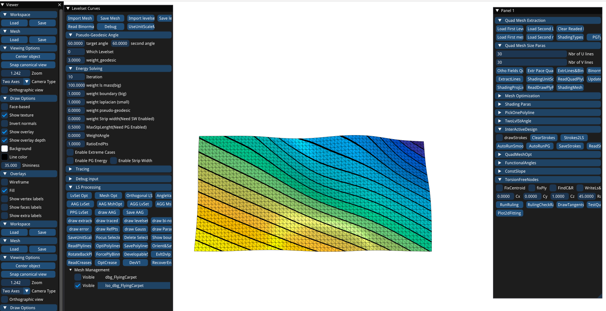
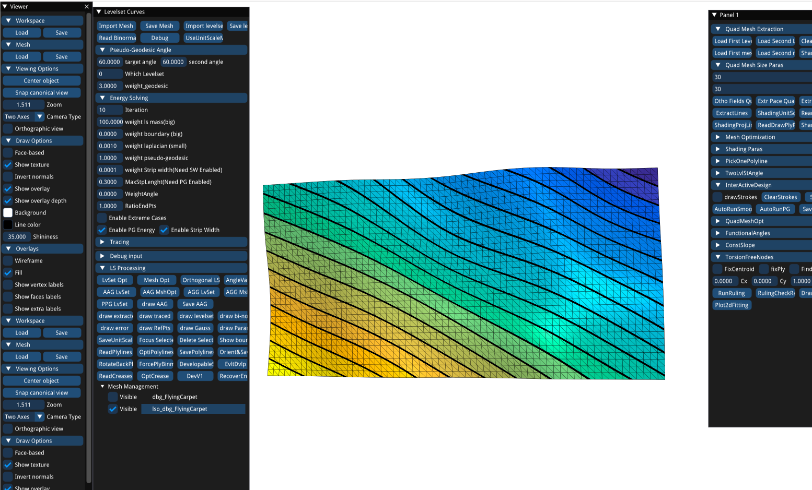
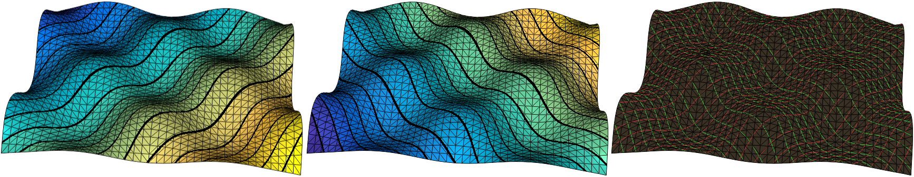
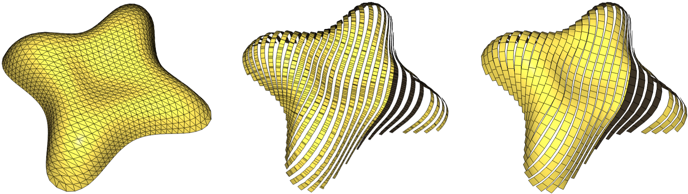
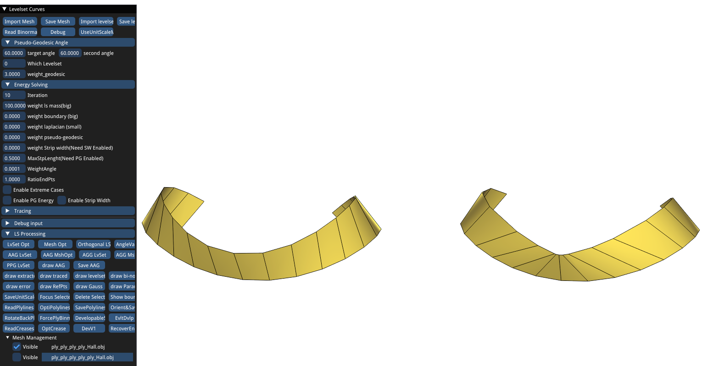

# Rectifying Strip Patterns

This is an implementation of the paper "Rectifying Strip Patterns" (SIGGRAPH ASIA 2023). The code is implemented in C++, and tested on MSVC and GCC. This is a framework to design rectifying strips/structures, including a scalar field optimization framework, a quad mesh optimization framework, code for optimizing binormal strips into rectifying strips, etc. 

## Citation

If you use our code in your project, please consider citing the original paper:

```bibtex
@article{Wang:2023:Rectifying,
    title        = {Rectifying Strip Patterns},
    author       = {Bolun Wang and Hui Wang and Eike Schling and Helmut Pottmann},
    year         = 2023,
    month        = oct,
    journal      = {ACM Transactions on Graphics},
    volume       = XX,
    number       = XX,
    articleno    = XX,
    numpages     = XX
}
```

## Compiling Instruction 
To compile the code, first you need to install CMake (https://cmake.org/), 
To build the executable on Linux or macOS:
```sh
cd level-set-curves/
mkdir build
cd build
cmake ../  -DCMAKE_BUILD_TYPE=Release
make
```
Then double-click the executable `lsc_devbin`, you will see a pop-out window whose buttons link the functions that generate all the results in our paper. 

  

## Usage
Some useful shortcuts:
* `i` is to invert the normal directions of the viewer.
* `d` is to enable double-sided rendering.
* `x` is to delete the selected mesh in the `Mesh Management` list.

Some tips:
* Please always check if there is any new mesh added into the `Mesh Management` list. Sometimes after pressing the buttons, there is no change in the main view window, but the new mesh is already added into the list. To see the renderings of the new results you need to make other meshes invisible by clicking the checker boxes on the left of the mesh files.
* Please always check the information printed in the terminal, it will tell you the numerical errors, how to read/write files after pressing the corresponding buttons, if there are singularities, etc.
* Every time you get a scalar field, don't forget to save it using `Save levelset`. If you have a scalar field and a model in the framework, close the exe and reopen it before loading another model or scalar field.
* When it prints "flip u" in the terminal, it means the convergence is not stable. You should first use a small `weight pseudo geodesic`, run a few iterations until it turns stable, then gradually increase the weight.
* When it prints "Singularity" in the terminal, it means there are singularities in the scalar field. Enhance the constraints on smoothness and strip width until the singularities disappear.


### Interactive design of P-curves
* Press the button `UseUnitScaleMesh` on the top left of the viewer to unit-scale the mesh.
* Draw the guide curves: Press the key `3` on the keyboard, and draw a few curves on the surface using your mouth, then release the key `3`. Make sure that there is no intersection. The strokes should be smooth, generally in the same direction, as shown below



* If you are not satisfied with the strokes, you can clear the strokes by pressing `Panel 1 -> InterActiveDesign -> ClearStrokes`. A clean mesh will be added to the `Mesh Management` so that you can redraw curves on it. 
* Press the button `Stroke2LS` to confirm the drawing.
* Press `AutoRunSmooth` to generate the smooth level sets that follow the strokes. The details for each iteration is printed in the terminal. The target P-curve angle $\theta$ is also printed out, e.g. "target_angle, 76.5434".
* After obtaining the smooth level sets generally following the strokes, press `AutoRunPG`, wait for a few seconds, then the scalar function whose level curves are pseudo-geodesic curves of $\theta$ is generated. Press `Save levelset` to save the scalar field and the binormal vectors. In this step, the scalar field is automatically optimized using the default parameters.
### Initialize the scalar field by tracing P-curves.

* Open the exe by double-clicking it, there is a default mesh already loaded. If you want to use another mesh, load it by pressing `Import Mesh`, delete the default mesh, and now you have a clean workspace. 
* Trace guide curves using the buttons under the `Tracing` catalog. The start points of tracing curves are on the boundary of the mesh. There are two `TracingType` you can choose to quickly decide where the start points are. `SegTrace` chooses a segment that contains "`nbr bnd edges`" edges of the boundary starting from the "`start bnd edge`"th edge of the boundary loop. The distance between two neighboring start points is "`every i segments`". Another `TracingType` is `OneEdgeTrace`. If your mesh has corner points on the boundary, you can select the "`Select 1 boundary`"th segment of the boundary curve split by the corner points. `corner angle` helps to decide the corner points. The following figure shows the traced curves under `OneEdgeTrace` mode.
  
  
* Now we trace curves. Set up the `start angle` and $\theta$ = `target angle`, press `Trace Curves`, and P-curves will be traced out and rendered in the viewer. 
* Or, you can also trace 1 curve each time by properly setting up the parameters under `SegTrace` mode, save and load them one by one. This gives you more precise control of the start directions and curve locations.
* Make sure there is no intersection in the traced curves. 
* Now we turn to `Energy Solving` catalog. Tune `weight boundary` and `weight laplacian` and press `LvSet Opt` under the `LS Processing` catalog, you will see the generated level sets after running a certain number of iterations decided by `Iteration`.
* Save the scalar field if you are satisfied with the quality. See figure:
  

### Optimize for P-curves with user-specific parameters
* Press `Import levelset` to load a scalar field and `Import Mesh`.
* Set up `weight laplacian` to control the smoothness, `weight Strip width` to control the gradient not far from 1, `weight pseudo geodesic` for the $E_{angle}$. Set the checker boxes `Enable PG Energy` and `Enable Strip Width` as TRUE, then run `LvSet Opt` to optimize for $\theta$ = `target angle`. The figure below shows P-curves of $\theta = 60^\circ$ and the optimization parameters. 
  


* We recommend you start from large `weight laplacian` and `weight Strip width`, and small `weight pseudo geodesic`, then gradually change the parameters as what we showed in the figure above, to improve the stability of optimization.
* Note that the errors printed in the terminal are the sqrt of the energy. the example above prints out "pg, 0.00318374" meaning that the error $E_{angle} = 0.00318374^2 =$ 1.01e-5.
* To use $E_{geo}$ and  $E_{asy}$ for geodesic and asymptotic instead of $E_{angle}$, you can set `Enable Extreme Cases` as TRUE. If `target angle` = 0,then $E_{asy}$ is enabled; Otherwise, $E_{geo}$ is enabled.

### Optimize level sets for AAG.
After obtaining the scalar fields for the two families of asymptotic curves, load the two fields using `Load First Level Set` and `Load Second Level Set`, respectively. We call the 3 scalar fields F, H and G, where G is the 3rd scalar field. Now we optimize the 3 scalar fields simultaneously. You can input the parameters as before, and there are some new parameters: 
* `weight_geodesic` is a ratio of the parameters of G, which means the weights for G are $weight *$`weight_geodesic`, while for F and H are $weight$. It makes the optimization easier since we can start from a vanishing G and gradually add G back. 
* `weight boundary` now becomes the weight for the condition $F+H+G=0$.
* Under the catalog `Panel 1 -> TwoLvlStAngle` there are buttons and parameters to set up the angles between the level sets of F and H. For AAG optimization we don't need them since the asymptotic directions are totally decided by the geometry, but for AGG, PPG, etc., the angle constraints can be useful to generate visual-pleasing meshes. Remember to set the `WeightAngleOfLSs` as small values since they can only be weak constraints.

* Press `AAG lvSet` to run the optimizations. You can also press `AGG LvSet` to run AGG, or `PPG LvSet` to run PPG. Press `Save AAG` to save 3 scalar fields in a row (works for AAG, AGG and PPG). The pseudo-geodesic angles $\theta_F$ and $\theta_G$ for PPG are `target angle` and `second angle`, respectively.

### Extracting quad mesh from scalar fields
* Load the two scalar fields: `Load First Level Set`, `Load Second Level Set`. 
* For nets that only contain two families of curves, press `Ortho Fields Quads`, then you can save the generated quad mesh and some mesh structure info files. The number of parameter lines of each scalar field can be controlled by `Nbr of U lines` and `Nbr of V lines`.
* For 3-webs like AAG, AGG and PPG, whose diagonals of the quads are also mesh edges, please use `Extr Pace Quad`. `Nbr of U lines` will control the density. It will sample both the u and v scalar functions with an even pace to make sure $F+H+G=0$. The 3-webs are also saved as quad meshes. The diagonal information is written into the info files generated when you are saving the quads. See the figure below showing the two scalar fields and the extracted quad mesh.
  
  

### Quad mesh optimization
The optimization for PP, PPG, AAG, AGG is integrated under `QuadMeshOpt` catalog. 
* Load a quad mesh using `LoadQuads`. It will require you to type down the name of the quad mesh and the prefix of the info files.
* Make sure you have an underlying triangle mesh loaded. You will approximate your quad mesh to the triangle mesh. Press `LoadTriangleTree` to pass the triangle mesh data into the quad mesh optimization framework.
* Choose the correct `QuadType`. Press `Set&Reset` to Initialize. It will draw one iso-u line, one iso-v line and one diagonal line in the viewer, in the colors red, green and blue, respectively (as shown below). If you find that the blue line doesn't match the correct one of the two diagonal directions, you can choose the correct diagonal directions in the `FamilyOfDiag` and initialize again. You can run 1 iteration for the test: in the terminal, the estimated P-curve angles for the iso-u and iso-v curves will be printed out, it will help you to input the correct target angle $\theta$ or $\pi - \theta$. See the figure below showing the triangle mesh and the quad mesh loaded. The estimated angles are 115.555 and 115.42 after 1 iteration, while the designed angles are 60 and 120. It means the input target angles should be 180 - 60 = 120 and 120.
  
  

* The parameters are: `weight boundary` for approximating to the triangle mesh, `weight laplacian` for smoothness, `weight pseudo-geodesic` for the angle condition, `weight_geodesic` as a ratio multiplied to `weight pseudo geodesic` as a weight for obtaining accurate binormal vectors. After finishing the optimizations, you can choose the generated mesh in the `Mesh Management` list, click on `Save Mesh` to save the quad mesh. And press `writePlyInfo` to save the binormal strips. 

###  Extracting and optimizing binormal strips
As has been discussed before we can get the binormal vectors through quad mesh optimization. Actually after optimizing level sets for P-curves, the binormal strips can be easily obtained: `Nbr of U lines` controls the number of strips extracted. With the underlying triangle mesh and scalar field imported using `Load First Level Set`, press `ExtrLines&Binormals`. It will require you to type down the prefix of the files, and load the binormal files extracted from the level set optimization stage. Then, the strip files will be saved. 

Now we load the binormal strips using `ReadPlylines` and type down the prefix of the files. The strips will be loaded and re-sampled. The reviewer will render the strips, and these strips are already resampled once you load them. The sample density is controlled by `Nbr of U lines`. If you don't want to resample the polylines, just set it as -1.

* The mission is to obtain accurate binormal vectors of the polylines, while keeping the desired P-curve angle $\theta$. The quad meshes for the strips are the offset of the polylines along binormal vectors. We can also see the inverted elements meaning that the binormal vectors between strips are not consistent. We deal with this problem later.
* `weight ls mass` is to approximate the strips to the underlying surface. `weight laplacian` is to control the smoothness of the polylines. `weight_geodesic` is a ratio multiplied by `weight laplacian` to play a role as a weight for smoothing neighboring binormal vectors. This is useful for correctly determining the binormal vector direction if the neighboring two edges are almost colinear. `weight pseudo-geodesic` is for accurate binormal vectors, `WeightAngle` is for accurate $\theta$ = `target angle`. 
* Press `OptiPolylines` to start optimizations. Press `Save Polylines` to type down the prefix and save the polylines. `Orient&SavePlys` is to deal with the orientations of the binormal vectors: it compares the binormal vectors of the neighbouring two polylines, and orient the binormal vectors if one of the polylines is inverted. `ForcePlyBinm` is also useful: pressing it will set all the binormal vectors in the same direction. It fixes problems like binormal vectors are inverted even within one strip, and gives a good starting point so that the convergence could be improved.

 

### Optimizing for rectifying developable.
The rectifying strips are obtained by optimizing binormal strips obtained from binormal strip optimization or quad mesh optimization. 

* Load binormal strips with `ReadCreases`. `weight ls mass` is to approximate the polylines to the polylines of the input binormal strips. `weight laplacian` is to provide smooth polylines.  `WeightAngle` is to improve the isometry with straight flat strips. 
* Press `Optreases` to run the optimizations. Press `SavePolylines` to save the results. The figure below shows the parameters, the binormal strip, and the rectifying strip. This case is simple containing no reflection points, thus we are able to set `weight laplacian` = 0.
* You can also use `DevV1` to try the first version of rectifying strips mentioned in our paper.

 

### Shading system design

The majority of the related buttons are under `Shading Paras` catalog.
* `Enable Extreme Cases` and `Shading` as TRUE to enable shading system design mode. 
* Input the `Latitude` and then `SaveRotatedMesh` to represent the mesh under global coordinates by rotating.
* Initialize the scalar field (e.g. drawing strokes), and save the result.
* Load the mesh and the scalar field, set up the middle point of the light source using `T0`, `P0` for the $\theta$ and $\phi$ values. Set up the considered light region using `Ttol0` and `Ptol0`.
* Run the optimization by clicking `LvSet Opt`.
* After getting the scalar fields, extract the strips, and optimize to improve the quality through binormal strip optimization and rectifying strip optimization.

## Some more info
* There are more buttons for visualizing the level sets for AAG and the optimization errors, getting the statistics for timing, optimizing triangle meshes, designing curves with constant slope, etc. For most of the buttons you can understand them easily by their names. If you are not sure what the button does, please read our code!
* It requires some technique and experience to get high-quality, visually pleasing results. In the data folder, there are some data for you to test.
